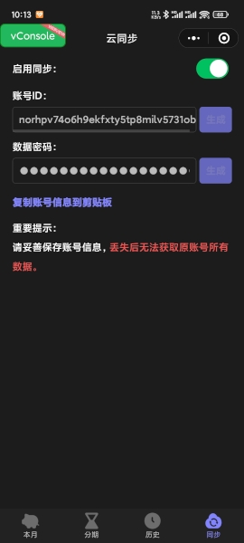

## 反赊账记录器

### 1. 简介

如果你经常每月花钱超支，那么这是一款可以帮助你管理收支的微信小程序。

App正在开发中

微信小程序扫码体验

介绍图

  

   

### 2. 云同步功能说明

云同步功能通过对象存储实现，每个用户的数据存在对应的文件夹中。

为了保证用户数据安全，策略只开放了获取和上传两个接口，并且采取AES和MD5的方式加密数据和文件名，确保在用户密码不泄漏的情况下，无法获取别人的数据，也不知道别人的文件夹名。

 

---

### 您的支持是我不断贡献的动力

