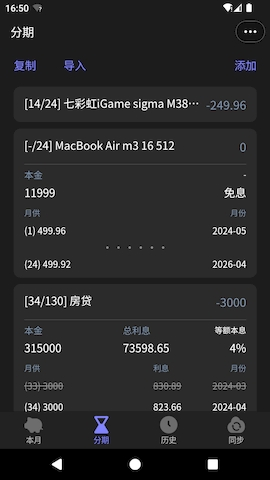
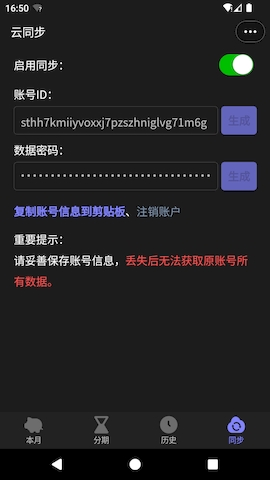

## 反赊账记录器

### 1. 简介

这是一款简约的按月记账App，可以帮您管理每月零碎收支，以及分期和贷款。

如果您每月正在为花钱超支而苦恼，可以试试这款App。

介绍图

  

   

### 2. 软件下载

#### 2.1. 小程序

微信扫码

#### 2.2. 安卓

华为、小米、荣耀、OPPO、vivo、应用宝、豌豆荚、360、百度

#### 2.3. 鸿蒙

华为

#### 2.4. iOS

苹果

#### 2.5. Web

#### 2.6. 快应用

### 3. 主要功能一览

### 4. 云同步功能说明

云同步功能通过对象存储实现，每个用户的数据存在对应的文件夹中。

为了保证用户数据安全，策略只开放了获取和上传两个接口，并且采取AES和MD5的方式加密数据和文件名，确保在用户密码不泄漏的情况下，别人无法获取你的数据，也不知道你的文件夹名。

 

---

### 您的支持是我不断贡献的动力

